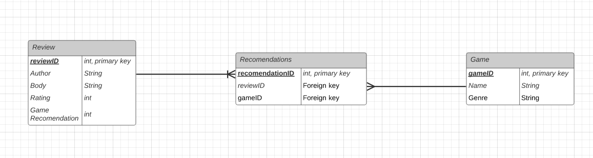

# DevOps Core Fundamental Project 
The aim of this project is to create a fully functioning CRUD application, which allows me to develop and showcase the core modules that I covered during the first 4 weeks of my training.

This project will thus allow my trainers to assess my capabilities with the techonologies and methodologies I have been taught, as well as assessing my development against the SFIA.

## Requirements
The following requirements are also expected to be achieved alongside the aims of this project:
* The use of a Trello Board(s) to prove an Agile methodology has been considered
* The use of a relational database, with atleast one relationship
* The use of fully designed test suites, with automated tests to ensure a high rate of code coverage in both the front and back-end. 
* The use of flask  to help create a functioniong website
* The use of GitHub and Virtual machines hosted on the Google Cloud Platform, allowing for version control via a CI server.

## Game reviewing App
To help me achieve the aims and requirements of this project, I will create a game reviewing web application.

When the user attempts to create a review, he/she will be asked to input the following:
  * Title of the review
  * Body of the review
  * Other game recomendations
  * Name of the author
  * Rating out of 5

Furthermore, user's will also be able to read other reviews, and as well as edit and delete their own reviews.

# Design

## Database Structure

The ERD above showcases the relationships found in the databasse. A many-to-many relationship exists between Reviews and Games, achieved via the Recommendations table which acts as the association table. This relationship allows users to recommend multiple games, and multiple games can be recomended by a single review.

## CI Pipeline

To be completed when better understood.
Keywords to include: Github, Jenkins, pytesdt, flask-app and systemctl, gunicorn

# Project Tracking

To ensure that a Agile methodology has been followed, the progress of this project was recorded and tracked on a Trello Board found in the link below:

https://trello.com/b/Ko0VjPhl

