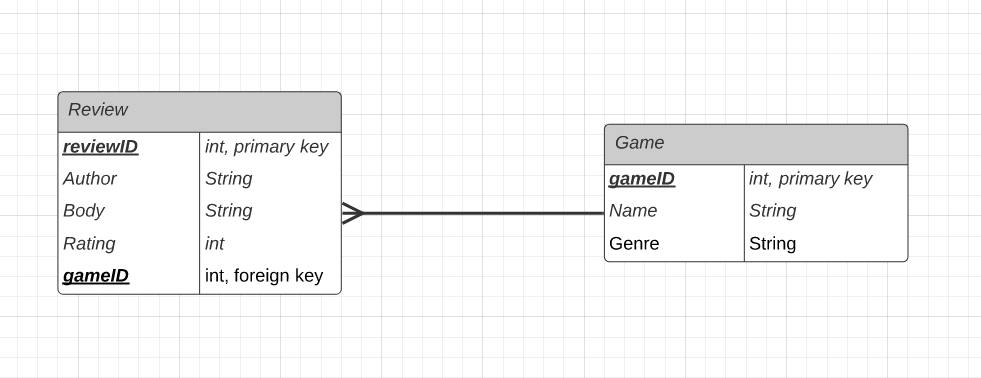

# DevOps Core Fundamental Project 
The aim of this project is to create a fully functioning CRUD application, which allows me to develop and showcase the core modules that I covered during the first 4 weeks of my training.

This project will thus allow my trainers to assess my capabilities with the techonologies and methodologies I have been taught, as well as assessing my development against the SFIA.

## Contents

To be added once project completed

## Requirements
The following requirements are also expected to be achieved alongside the aims of this project:
* The use of a Trello Board(s) to prove an Agile methodology has been considered
* The use of a relational database, with atleast one relationship
* The use of fully designed test suites, with automated tests to ensure a high rate of code coverage in both the front and back-end. 
* The use of flask  to help create a functioniong website
* The use of GitHub and Virtual machines hosted on the Google Cloud Platform, allowing for version control via a CI server.

## Game reviewing App
To help me achieve the aims and requirements of this project, I will create a game reviewing web application.

When the user attempts to create a review, he/she will be asked to input the following:
  * Title of the review
  * Body of the review
  * Other game recomendations
  * Name of the author
  * Rating out of 5

Furthermore, user's will also be able to read other reviews, and as well as edit and delete their own reviews.

# Design

## Database Structure

The ERD below showcases the relationships found in the databasse. A many-to-many relationship exists between Reviews and Games, achieved via the Recommendations table which acts as the association table. This relationship allows users to recommend multiple games, and multiple games can be recomended by a single review.

During the development of thep project, it was discovered that a Many to many relationship was no necessary for the completion of the project. This made the recommendations table redudant, and so a diagram had to be constructed to showcase the entity relationships:

## Continuous Integration (CI) Pipeline

CI is the method of automating the integration of code changes from many developers into a single project. I have integrated this methodology via the use of various frameworks, as shown in the diagram below. 

In this pipeline, a developer can simply look at tasks to be completed on the Trello board, pull from the Repository to work on the code and then push once they are finished. This code is then automatically installed, tested and deployed via the Jenkins server. Any test failures/issues can be seen in the reports created

# Project Tracking

To ensure that a Agile methodology has been followed, the progress of this project was recorded and tracked on a Trello Board found in the link below:

https://trello.com/b/Ko0VjPhl

The Trello board is used as a Scrum board. Scrum boards help make Backlog items more visible, while also showing all items that need to be completed in the most recent sprint. Scrum boards can be categorised to help seperate the workflow. This helps ensure a clear focus is present at all times of development. This Trello Board for this project is broken down into the following categories:

   * Project Requirements: These requirements are the bare minimum that the project must have, also known as Minimum Viable Project
   * Project Resources: Links, tables and graphs relating to the project
   * User Stories: User stories are statements which exist to showcase all the functionality of the application. By putting them into stories, they allow us to follow a step-by-step procedure to create each functionality.
   * To be Completed: Aspects of the project that haven't been started
   * Currently being added: Aspects that are currently being developed and added
   * Testing: This list refers to all aspects of testing, that are yet to be completed
   * Successfully added: Aspects of the project that have successfully been added.
  
  # Risk Assessment
A [risk assessment](https://docs.google.com/spreadsheets/d/1rV_37JyttRklZ-s-0o_n9_5RRai0x6cwT8nH0TWXFfA/edit?usp=sharing) was conducted before the start of the project as a tool for identifying and preventing potential project risks. However, unanticipated risks are expected as in any project, and so a final risk assessment is also conducted after the compeletion of the project to prevent any further risks. The final risk assessment is shown below:

During development, some additional risk were discovered. These were then added to the risk assessment so that they could be properly managed. These risks can be found in the risk assessment as the last two risks added.
  # Testing
Before any testing was undertaken, [analysis](https://docs.google.com/spreadsheets/d/1OfFZ9vwDHFIqsNnYMJ-dNl1Pc47DokX4H7gkPtnL4SU/edit?usp=sharing) of what needs to be tested was completed. This was done in the form of a table and can be seen below:

Testing was conducted via the use of PyTest, in conjunction with Flask-testing and Selenium. PyTest ensures the tests output a True or False value by "asserting" a specified condition. This conditions allow for a wide range of testing, from outputs in the program itself to changes in value in the tables in the database. These tests were then incorporated into Jenkins to allow for test automation. When Jenkins runs the tests, it also produces an output in the console, allowing for test reports to be seen.

Test coverage can be used as numerical.... Fortunately, PyTest allows for test reports to incorporate test coverage too, as shown below:

  # Front-End
As the purpose of this project was to create one with C.R.U.D Functionality, there was a lack of consideration towards HTML design and layout; This allowed for a website that was stable and bug-free.

WHen the User first enters the website, they are greeted with the following home page:

From here they are able to see the current reviews on site, as well as any games in the system that are able to be recommended in reviews. Each review shows the Author of the review, the review itself, the rating given to the gmae and as well as any game recommendations. At the top of the page is a navigation bar that can be seen on all other pages of the website too. This bar contains links to the home, Create Review and Add a Game websites.

Next comes the Create review page, as shown below:

Here the User can create a review by filling in the Correct forms. Flask Formn Validation is active on all fields so no field can be left empty. Once all the fields are filled out and the submit button is clicked, the User is taken back to the home page where they can view their review.

If the User wants to create a game in the database, they are shown the following page:

Again, Flask Form validation is active, and once the User clicks submit they are taken back to the home page once again where they can also view their new game. Games are all shown in a different section below the reviews. 

  # Improvements
Possible improvements:
   * Implement a Users table, and allow for User's to sign in and out.
      * This would allow for only the Authors of the review to be able to edit their reviews
   * Improved CSS designs throughout the site
    
  # Author

Kunal Singh 

  # Contributors
Harry Volker
Nathan Forester
